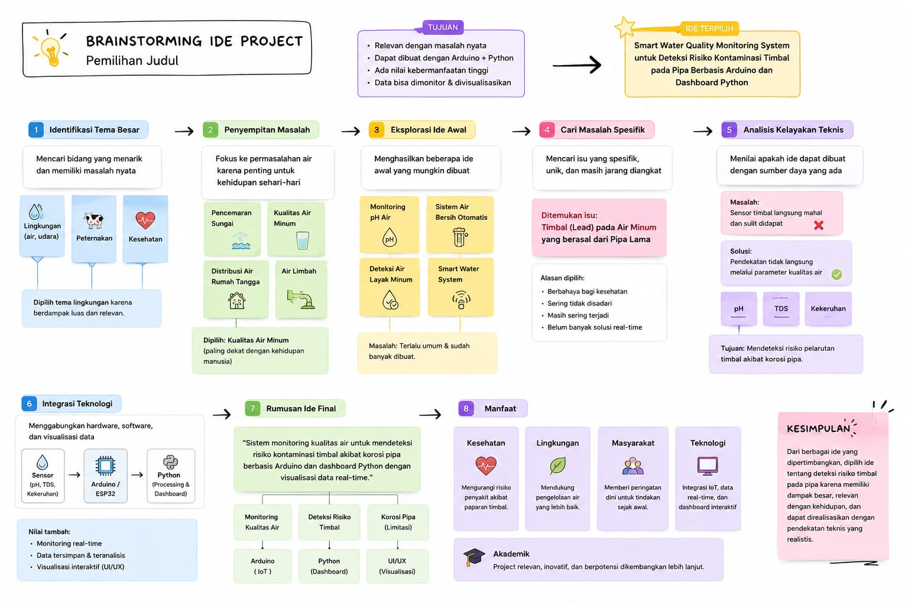
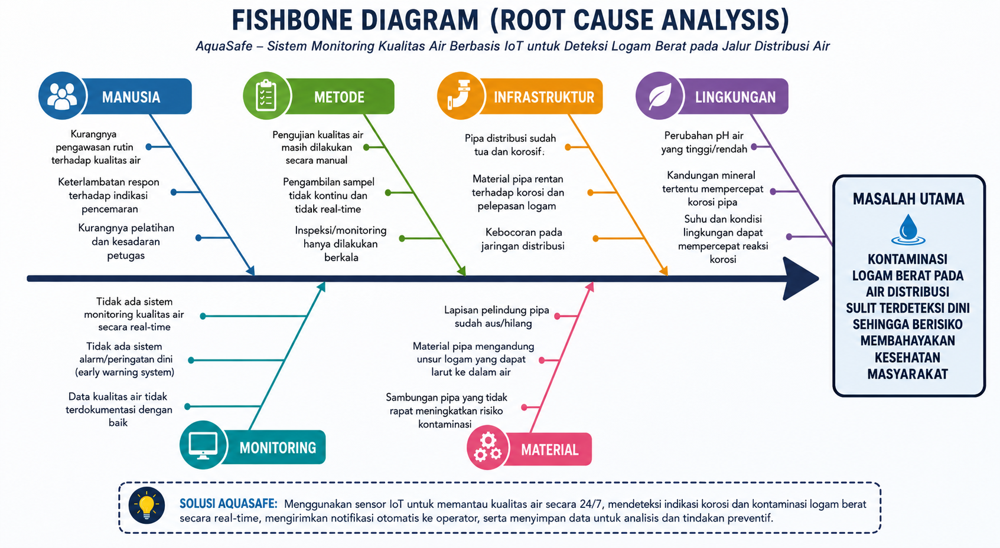
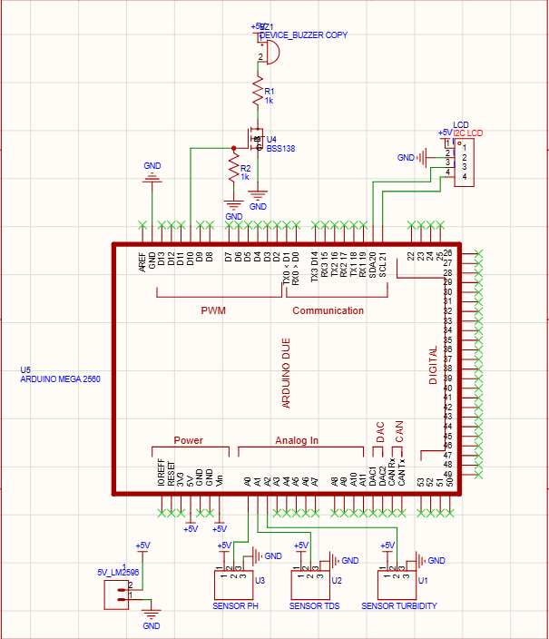

<div align="center">
    
#  AquaSafe Pipe

### Smart IoT-Based Water Quality & Corrosion Monitoring System


<div align="center">

<a href="https://wokwi.com/projects/466340546461805569" target="_blank">
    
</a>

<a href="https://drive.google.com/file/d/1aN81-LR9dHI82T2hj2gu4VYi9VdBelgS/view?usp=drive_link" target="_blank">
    
</a>

<a href="https://www.canva.com/design/DAHLUscpbcU/ThfkQryM6eWiujemS9Ijmg/edit" target="_blank">
    
</a>

<a href="https://drive.google.com/file/d/138hcCL8Yh9MlO2AB4PJltIPKVSc_EZjp/view?usp=drive_link" target="_blank">
    
</a>

</div>

### 🚰 Monitoring Kualitas Air dan Deteksi Korosi Pipa Berbasis IoT

</div>

---

## 📖 Overview

📝 Deskripsi Proyek
AquaSafe Pipe adalah solusi Internet of Things (IoT) berbasis mikrokontroler yang dirancang untuk menjawab tantangan keamanan distribusi air bersih. Sistem ini melakukan pemantauan parameter kualitas air secara real-time untuk mendeteksi dini risiko korosi pipa dan kontaminasi logam berat (seperti Timbal/Pb) yang sangat berbahaya bagi kesehatan.

Dengan integrasi sensor presisi dan konektivitas IoT, AquaSafe Pipe memberikan visibilitas penuh atas kondisi air yang mengalir di pipa distribusi, memungkinkan pengelola sistem air untuk mengambil tindakan preventif sebelum terjadi kegagalan infrastruktur atau pencemaran massal.

🚀 Fitur Utama
Pemantauan Real-Time: Monitoring kontinu parameter kualitas air (pH, TDS, Kekeruhan).

Deteksi Korosi: Analisis data untuk mengidentifikasi kondisi air yang agresif (risiko tinggi korosi).

Dashboard IoT: Visualisasi data jarak jauh yang informatif dan mudah diakses.

Peringatan Dini: Sistem notifikasi otomatis jika parameter air melewati ambang batas keamanan.

Skalabilitas Tinggi: Menggunakan Arduino Mega 2560 yang memungkinkan penambahan sensor tambahan di masa depan.

🛠️ Spesifikasi Teknis
Perangkat Keras (Hardware)
Microcontroller: Arduino Mega 2560 (ATmega2560)

Sensor Kualitas Air:

Sensor pH: Mengukur tingkat keasaman/kebasaan air.

Sensor TDS: Mengukur total padatan terlarut (kadar mineral/kontaminan).

Sensor Turbidity: Mengukur tingkat kekeruhan air.

Komunikasi: I2C untuk display dan UART virtual untuk Streamlit phyton

Power Supply: 12V DC Adapter
## 🎯 Project Objective

Membangun sistem pemantauan kualitas air pipa berbasis mikrokontroler Arduino Mega yang mampu mendeteksi potensi korosi dan pelarutan timbal (Pb) secara real-time guna mencegah kontaminasi air bersih serta memungkinkan tindakan preventif secara cepat melalui dashboard monitoring jarak jauh.

---

## 🎓 Academic Information


---

## 👨‍💻 Team Members

| No | Name                 | NRP        | Role              | Akun GitHub                        |
| -- | -------------------- | ---------- | ----------------- | ---------------------------------- |
| 1  | Rofif Fairuz Zaki    | 2124600040 | Project Manager   | https://github.com/RofifFairuzZaki |
| 2  | Didit Bayu Kurnianto | 2124600047 | Programmer        | https://github.com/diditbayukurnianto|
| 3  | Ridho Yanuar         | 2124600046 | Hardware Engineer | https://github.com/RidhoYanuarAl |
| 4  | Moch. Akhdan Nabilly | 2124600038 | 3D Designer       | https://github.com/MochAkhdanNabilly|
| 5  | Anggara Bayu Saputra | 2124600057 | UI/UX Designer    |https://github.com/anggarabayusaputraku-creator|
| 6  | Aissyah Fitriani     | 2124600059 | Nonteknis         | https://github.com/aissyahfitrian |

---

### Supported By

```markdown
👨‍🏫 Dosen Pengampu : Akhmad Hendriawan, ST., MT. (NIP. 197501272002121003)
 
📚 Mata Kuliah    : Mikrokontroler

🎓 Program Studi  : D4 Teknik Elektronika

🏛️ Institusi      : Politeknik Elektronika Negeri Surabaya (PENS)
```

---

## ✨ Features

✅ Monitoring pH secara Real-Time

✅ Monitoring TDS secara Real-Time

✅ Monitoring Kekeruhan Air (Turbidity)

✅ Deteksi Potensi Korosi Pipa

✅ Monitoring Dashboard IoT

✅ Sistem Peringatan Dini (Alert System)

✅ Pemantauan Jarak Jauh

✅ Data Logging dan Analisis

---

## 🏗️ System Architecture
 
<div align="center">
    
  
  
</div>

---

## 🛠️ Technologies Used

* Arduino Mega 2560
* ATmega2560
* IoT Dashboard
* Embedded C Programming
* Water Quality Sensors
* Corrosion Monitoring System

---

## 🔧 Komponen
| No | Komponen | Qty |
| :---: | :--- | :---: |
| 1 | Arduino Mega 2560 Compatible | 1 |
| 2 | Sensor pH + Probe pH | 1 |
| 3 | Sensor TDS Gravity | 1 |
| 4 | Sensor Turbidity | 1 |
| 5 | LED Merah 5 mm | 1 |
| 6 | LED Kuning 5 mm | 1 |
| 7 | LED Hijau 5 mm | 1 |
| 8 | Resistor 220 Ω | 3 |
| 9 | Buzzer Aktif 5V | 1 |
| 10 | Kabel Jumper Set | 1 |
| 11 | Adaptor/USB Power Supply | 1 |

--- 

## 🔬 Sensors Used

| Sensor           | Function                       |
| ---------------- | ------------------------------ |
| pH Sensor        | Mengukur tingkat keasaman air  |
| TDS Sensor       | Mengukur jumlah zat terlarut   |
| Turbidity Sensor | Mengukur tingkat kekeruhan air |

---

## 🐟 Fishbone Analysis


---

## 🧠 Mind Map

<div align="center">



</div>

---

## 📊 Block Diagram

<div align="center">



</div>

---

## UI/UX Web Dashboard

<div align="center">
  
  
  
</div>

---

## ⚙️  Visualisasi Sistem

<div align="center">

 

</div>

---

## Hardware
<div align="center">
  
</div>
<div align="center">
  
</div>
<div align="center">
  
</div>
<div align="center">
  
</div>


---

## ⚙️  3D Desain
Produk yang kita tawarkan adalah sambungan pipa yang sudah siap pasang dengan sensor-sensor yang sudah terpasang
<div align="center">


</div>

<div align="center">


</div>
<div align="center">


</div>

---

## 📸 Project Documentation

<div align="center">


</div>

---

<div align="center">

### 💧 AquaSafe Pipe

Smart Monitoring • Safe Water • Better Future

© 2026 Kelompok 4 – D4 Teknik Elektronika PENS

</div>

